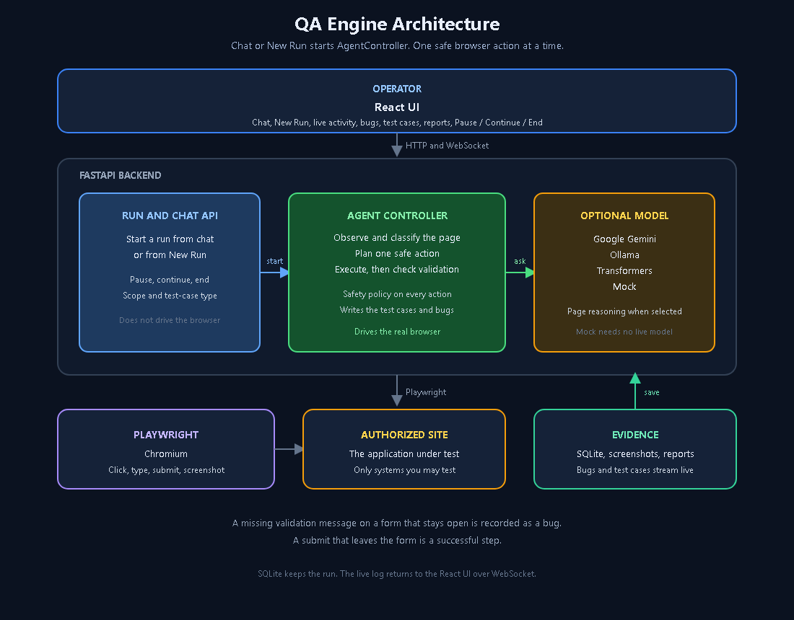

# QA Engine

**Autonomous QA agent for QA and development teams — exploratory, regression, and retesting of authorized web applications.**

QA Engine opens a real browser, explores the target, fills and submits forms, exercises CRUD workflows, captures evidence, and writes a structured QA report. Run it for a first-pass exploration, again after a bug fix (retesting), or after a change on the same authorized site (regression smoke). It is not a saved scripted test suite and it does not replace a full QA strategy.

| | |
|---|---|
| **QA engine** | AgentController + Playwright |
| **Browser** | Direct Playwright (Chromium) |
| **Canonical demo** | [Thinking Tester Contact List](https://thinking-tester-contact-list.herokuapp.com/) |
| **Source** | [github.com/M-Ilays/QA-Engine](https://github.com/M-Ilays/QA-Engine) |
| **Optional model** | Google Gemini API (`GEMMA_PROVIDER=gemini`) |

It does not fully test every screen of an application. **Only test systems you own or are explicitly authorized to test.**

---

## Who it is for

QA engineers and developers who still do exploratory testing, retesting of fixes, and another browser pass after a release by hand.

---

## What QA Engine is

You submit an authorized URL (and optional credentials) from the New Run UI. The backend starts a QA run, launches Chromium via Playwright, and drives one safe action at a time.

1. Perception and planning engines observe the page and choose the next action.
2. The Model dropdown (Gemini, Ollama, Mock, …) supports page analysis, action selection, and bug evaluation.
3. Evidence (screenshots, traces, activity log, reports) is written under `gemmaqa/evidence/<run_id>/`.
4. You can **Pause**, **Continue**, **End Run**, and adjust **Execution Speed** / **Action Pause** while the run is live.

New Run starts AgentController + Playwright. Gemini is optional, not required.

---

## Key capabilities

- Exploratory, regression, and retesting passes on an authorized URL
- Autonomous exploration and intelligent planning
- Direct Playwright (Chromium) execution
- Form filling, submission, validation-error detection, and recovery
- CRUD workflow testing (create / read / update / delete of *QA Engine’s own* test records, when permitted)
- Live activity log over WebSockets
- Operator controls: Pause, Continue, End Run, Execution Speed, Action Pause
- Safety checks: authorized domain, action classification, destructive-action permission

---

## Architecture

Full write-up: [`ARCHITECTURE.md`](ARCHITECTURE.md). Diagram for judges:



```
QA Engine UI
  → FastAPI (chat and runs)
    → AgentController
      → optional model (Gemini, Ollama, Transformers, Mock)
      → Playwright Chromium
      → authorized website
    → SQLite, screenshots, reports
```

| Layer | Stack |
|---|---|
| Frontend | React, Vite, TypeScript, Tailwind CSS |
| Backend | Python 3.11+, FastAPI, Playwright, Pydantic, SQLAlchemy, SQLite, WebSockets |
| QA engine | AgentController |
| Optional QA model | Gemini API, Ollama, Mock |
| Browser | Direct Playwright Chromium (default). Playwright MCP is an optional adapter. |

---

## Autonomous QA workflow

1. Confirm authorization in the UI (`authorization_ack`).
2. Start a run against an allowed URL (default Contact List).
3. Enable **test-data creation** for CRUD. Enable **deletion of QA Engine’s own test records** if you want Delete Contact / cleanup.
4. AgentController observes the page, plans one action, validates it against safety policy, and executes it with Playwright.
5. Validation failures (for example an invalid phone number) are treated as application feedback: the agent can recover and continue rather than repeating the same rejected input.
6. The run continues until you click **End Run**, a fatal error occurs, or an existing safety stop fires (for example no-progress / consecutive model failures). There is **no** action-count budget, **no** page-count budget, and **no** 15-minute runtime watchdog.
7. Reports are written under `gemmaqa/evidence/<run_id>/reports/`.

---

## Live controls

Available on the live run screen while the browser session is active:

| Control | Behavior |
|---|---|
| **Pause** | Stop after the current step |
| **Continue** | Resume a paused run |
| **End Run** | Finish now and keep the report so far |
| **Execution Speed** | Action execution pacing (`0.25x`–`4x`) |
| **Action Pause** | Delay between actions (`0s`–`10s`) |
| **Activity log** | Durable live log of what the agent is doing |

Safety checks stay on. Destructive actions (including deleting QA Engine-created records) require the matching New Run permission.

---

## Demo / verified behavior

Canonical site: **https://thinking-tester-contact-list.herokuapp.com/**

On that application, QA Engine has autonomously demonstrated:

- Signup
- Add Contact
- Edit Contact
- Delete Contact (requires **Allow deletion of QA Engine’s own test records**)
- Form validation detection
- Recovery after invalid phone-number input
- Continued autonomous exploration after those flows

This is not a claim that every Contact List feature was exhaustively tested.

---

## How to run locally

### Prerequisites

- Python 3.11+
- Node.js 18+
- Git
- Optional: Google AI Studio / Gemini API key (`GEMMA_PROVIDER=gemini`)

### Quick start

From `gemmaqa/`:

```powershell
# Windows
.\start-dev.ps1
```

```bash
# Linux / macOS
chmod +x start-dev.sh
./start-dev.sh
```

| Service | URL |
|---|---|
| Frontend UI | http://127.0.0.1:5173 |
| Backend API | http://127.0.0.1:8000 |
| OpenAPI docs | http://127.0.0.1:8000/docs |
| AI health (no secrets) | http://127.0.0.1:8000/api/ai/health |
| Default test target | https://thinking-tester-contact-list.herokuapp.com/ |

### Backend

```bash
cd gemmaqa/backend
python -m venv .venv

# Windows
.venv\Scripts\activate

# macOS / Linux
source .venv/bin/activate

pip install -r requirements.txt
# Optional Model-dropdown backend:
# pip install -r requirements-gemini.txt   # google-genai only
playwright install chromium
copy .env.example .env   # or: cp .env.example .env
```

Then set an optional QA model (placeholders only — never commit real secrets):

```env
# Optional: GEMMA_PROVIDER=gemini and GEMINI_API_KEY=...
BROWSER_ADAPTER=direct_playwright
```

Start the API:

```bash
python run.py
```

Set `ALLOW_LOCAL_TARGETS=true` only if you will test localhost or private hosts.

### Frontend

```bash
cd gemmaqa/frontend
npm install
npm run dev
```

UI: http://127.0.0.1:5173 (Vite proxies `/api` and `/ws` to the backend).

### Docker Compose (dev)

```bash
cd gemmaqa
docker compose up --build
```

Compose launches backend (8000) and frontend (5173). The compose file currently defaults `GEMMA_PROVIDER` to `mock` unless you override it. For a Gemini demo, prefer the local venv setup above.

---

## Configuration

Providers are selected by `GEMMA_PROVIDER`. Models are not loaded at import time.

| Provider | Role |
|---|---|
| `gemini` | Optional — Google Gemini API (`GEMINI_API_KEY`) |
| `openai_compatible` | Optional local rollback (Ollama, LM Studio, vLLM, …) |
| `mock` | Deterministic heuristics for CI / unit tests (no live model) |
| `transformers` | Optional local Hugging Face backend. |

Live Gemini example:

```env
GEMMA_PROVIDER=gemini
GEMINI_API_KEY=YOUR_GEMINI_API_KEY
GEMINI_MODEL_ID=gemini-3.5-flash
GEMMA_TIMEOUT_SECONDS=60
GEMMA_TEMPERATURE=0.1
GEMMA_SUPPORTS_IMAGES=true
GEMMA_MAX_CONSECUTIVE_FAILURES=3
```

Local Ollama rollback (not the default):

```env
GEMMA_PROVIDER=openai_compatible
GEMMA_API_BASE_URL=http://127.0.0.1:11434/v1
GEMMA_MODEL_ID=gemma3:4b
GEMMA_API_KEY=
```

Health (never exposes API keys): `GET http://127.0.0.1:8000/api/ai/health`

On provider failure the agent retries once, may take a safe deterministic action, records `ai_failure`, and stops model-driven actions after consecutive failures (`GEMMA_MAX_CONSECUTIVE_FAILURES`, default 3).

Full variable list: [`gemmaqa/.env.example`](gemmaqa/.env.example) and [`gemmaqa/backend/.env.example`](gemmaqa/backend/.env.example).

The API has **no authentication**. Bind to `127.0.0.1` for local demos. Never commit `.env` files or API keys.

---

## Testing

```bash
cd gemmaqa
backend/.venv/Scripts/python -m pytest tests -q   # Windows
```

Unit tests use the mock provider and do not call a live model.

Useful API routes:

| Method | Path | Description |
|---|---|---|
| GET | `/health` | Process health |
| GET | `/api/ai/health` | Provider config health (no secrets) |
| POST | `/api/runs` | Create and start a QA run |
| POST | `/api/runs/{id}/pause` | Pause |
| POST | `/api/runs/{id}/resume` | Continue |
| POST | `/api/runs/{id}/end` | End run |
| POST | `/api/runs/{id}/pacing` | Execution Speed / Action Pause |
| GET | `/api/runs/{id}/activity` | Live activity log |
| GET | `/api/runs/{id}/report.md` | Markdown export |
| WS | `/ws/runs/{id}` | Live progress |

---

## Docker and Cloud Run

A production **Dockerfile** at the repository root builds **one** service: FastAPI + the Vite SPA + Playwright Chromium. The image does **not** copy `.env` or API keys. Pass `GEMINI_API_KEY` at runtime (Cloud Run Secret Manager).

Local image (from this repository root):

```bash
docker build -t gemmaqa:local .
```

The container listens on `0.0.0.0:$PORT` (default 8080), serves the built frontend when `SERVE_FRONTEND` is set, and launches Chromium with Docker-safe flags (`PLAYWRIGHT_DOCKER=1`). SQLite and `evidence/` on the container filesystem are ephemeral.

Cloud Run spec (not applied automatically):

- [`Dockerfile`](Dockerfile) — production image
- [`deploy/cloud-run.yaml`](deploy/cloud-run.yaml) — service shape (`minScale=1`, `maxScale=1`, 2 CPU, 4Gi, 3600s timeout, CPU always allocated). Image field is a placeholder until you push to Artifact Registry.
- [`deploy/gcloud-run-deploy.sh`](deploy/gcloud-run-deploy.sh) — commented `gcloud run deploy` example

A live Cloud Run deploy needs a billed GCP project, Artifact Registry, and Secret Manager for `GEMINI_API_KEY` if you use the optional Gemini provider.

---

## Project structure

```
.
├── Dockerfile                 Production image (API + SPA + Chromium)
├── deploy/                    Cloud Run spec and example gcloud command
├── gemmaqa/
│   ├── README.md              Same product README (nested copy)
│   ├── backend/               FastAPI + AgentController + Playwright
│   ├── frontend/              React dashboard (New Run, live run, reports)
│   ├── evidence/              Per-run screenshots, traces, reports (generated, gitignored)
│   ├── tests/                 Unit tests (mock provider; fixtures under tests/fixtures/)
│   ├── start-dev.ps1          Local backend + frontend
│   └── docker-compose.yml     Dev compose (defaults to mock provider)
└── requirements-cloud.txt     Optional extra packages for Cloud Run tooling
```

Further reading: [`PRD.md`](PRD.md), [`ARCHITECTURE.md`](ARCHITECTURE.md).

---

## Hackathon notes

- Optional QA model: Google Gemini API (`GEMMA_PROVIDER=gemini`) from the Model dropdown.
- Demo app: Thinking Tester Contact List, not an in-house sample.
- Action/page budgets and the 15-minute runtime cap are removed; safety policy and operator End Run remain.

---

## Legal notice

**Only test systems you own or are explicitly authorized to test.** Unauthorized access or testing may be illegal. The UI requires an explicit authorization acknowledgement before a run can be created.

Credentials, when supplied, are held in memory for the active run and are not written to SQLite, logs, WebSocket events, or reports.

## License

MIT
